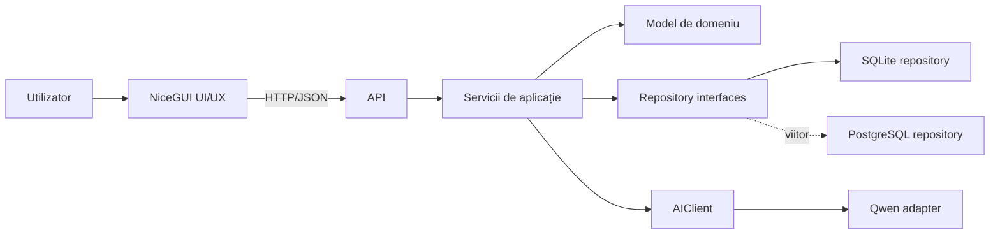

# Arhitectură

## 1. Stil arhitectural

Sistemul folosește limite explicite între prezentare, API, domeniu, persistență și AI. Dependențele tehnice sunt ascunse în adaptoare, astfel încât UI-ul, SQLite/PostgreSQL și Qwen să poată evolua independent.

## 2. Reguli de dependență

1. UI-ul comunică numai prin API.
2. UI-ul nu importă DAO, drivere DB sau clientul Qwen.
3. API-ul accesează DB numai prin repository interfaces.
4. API-ul nu depinde direct de `sqlite3` și nu cunoaște schema fizică.
5. API-ul accesează Qwen numai prin interfața `AIClient`.
6. Domeniul nu depinde de NiceGUI, SQLite, PostgreSQL sau SDK-ul Qwen.
7. Adaptoarele implementează interfețele definite spre interiorul aplicației.

## 3. Componente

### NiceGUI UI

Prezintă proiecte, documente, criterii, rapoarte, validări și decizii. Poate evidenția excepțiile, dar trebuie să permită inspectarea fiecărei validări și a fiecărui `SourceAnchor`.

### API

Deține contractele HTTP, validarea inputului, autorizarea operațiilor, idempotency și orchestrarea use case-urilor. API-ul nu expune căi de fișier interne, prompturi cu secrete sau răspunsuri brute neverificate de la model.

### Servicii de aplicație

Orchestrează crearea proiectului, versionarea criteriilor, ingestia rapoartelor, pornirea unui `AnalysisJob`, validarea rezultatului AI și înregistrarea unei `UserDecision`.

### Repository interfaces

Interfețe recomandate:

- `ProjectRepository`
- `DocumentRepository`
- `CriterionRepository`
- `ReportRepository`
- `CriterionValidationRepository`
- `UserDecisionRepository`
- `AnalysisJobRepository`

Implementarea inițială poate folosi SQLite. O implementare PostgreSQL trebuie să respecte aceleași contracte și invariante.

### AIClient

`AIClient` este singura poartă a aplicației către AI. Adaptorul Qwen mapează contractul intern la protocolul furnizorului. Contractul detaliat este în `contracts/ai-contract.md`.

## 4. Configurarea AI

Numele și adresa modelului AI sunt configurabile prin mediu, de exemplu:

- `AI_PROVIDER=qwen`
- `AI_MODEL_NAME=<nume-model>`
- `AI_BASE_URL=<adresă-serviciu>`
- `AI_API_KEY=<secret furnizat la runtime>`
- `AI_TIMEOUT_SECONDS=<timeout>`

Valorile reale, cheile și adresele interne nu se includ în Git. Configurația este citită în composition root și injectată adaptorului; nu este accesată direct din domeniu.

## 5. Fluxul unei analize

1. API-ul citește raportul și snapshot-ul criteriilor prin repository interfaces.
2. Creează un `AnalysisJob` și o cerere `AIClient` fără date din alte proiecte.
3. Adaptorul Qwen execută analiza.
4. API-ul validează schema, cardinalitatea criteriilor și ancorele de sursă.
5. Rezultatele valide sunt salvate ca `CriterionValidation` noi.
6. UI-ul citește rezultatele prin API.
7. Utilizatorul transmite `UserDecision` prin API.
8. API-ul păstrează decizia și istoricul fără suprascriere între rapoarte.

## 6. Responsabilități

| Zonă | Responsabil | Limita de ownership |
|---|---|---|
| API și contracte | Mihnea | endpoint-uri, scheme, contracte și compatibilitate publică |
| UI/UX NiceGUI | Andrei | experiența utilizatorului și consumul API prin HTTP |
| AI și Qwen | Emi | adaptorul Qwen, prompting, evaluare și respectarea `AIClient` |
| SQLite / PostgreSQL | Dragoș | schemă, repository adapters, migrații și integritatea datelor |

Schimbările care traversează o limită necesită coordonare cu responsabilul acelei zone.

## 7. Securitate și confidențialitate

- Documentele sunt izolate per proiect și accesate prin identificatori opaci.
- Conținutul integral al beneficiarului nu este logat.
- Pasajele din `SourceAnchor` apar doar în contexte autorizate și strict pentru audit.
- Cheile API sunt secrete de runtime.
- Conținutul documentelor este tratat ca input neîncrezător; instrucțiunile găsite în documente nu pot schimba contractul sau comportamentul sistemului.
- Erorile expuse UI-ului nu includ prompturi, tokenuri sau căi interne.

## 8. Evoluția implementării

Acest branch stabilește contextul, nu schimbă `DAO/` sau `DataBase/`. Orice migrare spre modelul țintă va fi o schimbare separată, cu teste, strategie de compatibilitate și aprobarea responsabililor API și DB.
