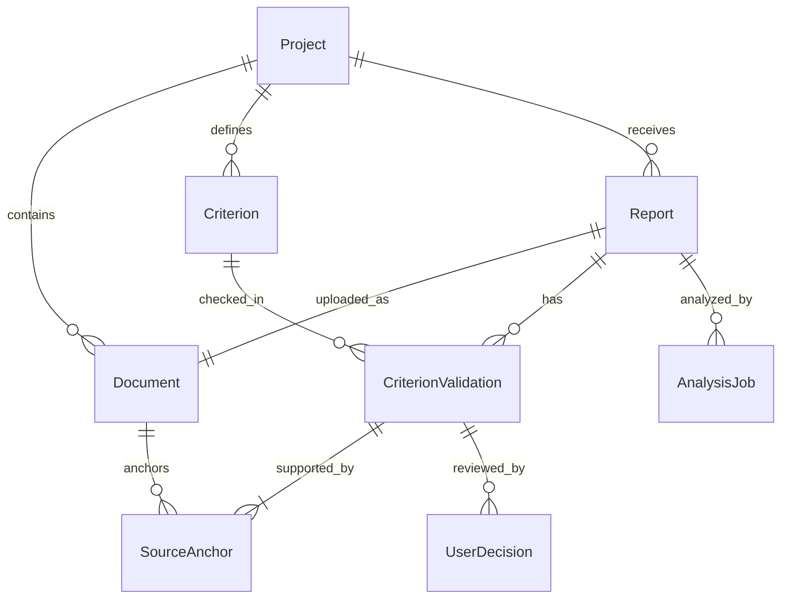

# Model de date conceptual

Acest document descrie modelul țintă. Nu modifică schema SQLite existentă din `DataBase/` și nu reprezintă încă o migrare.

## 1. Relații

## 2. Entități

### Project

- `id`
- `name`
- `fundingCallId`
- `completionDate`
- `monitoringYears` - valoarea configurabilă `X`
- `monitoringEndDate` - implicit `completionDate + monitoringYears`
- `status`
- `createdAt`, `updatedAt`

Un `Project` are documente, criterii și rapoarte. Data-limită trebuie validată față de contractul aplicabil înainte de utilizarea operațională.

### Document

- `id`
- `projectId`
- `kind`
- `originalFilename`
- `storageKey`
- `mediaType`
- `sha256`
- `pageCount`
- `createdAt`

Conținutul documentului nu se duplică în loguri sau metadate. `storageKey` este opac și nu expune căi locale.

### Criterion

- `id`
- `projectId`
- `version`
- `code`
- `description`
- `deadline`
- `severity`
- `activeFrom`, `activeTo`
- `sourceAnchorIds`

Un criteriu este versionat. Termenul canonic pentru contracte noi este `Criterion`; `obligation` rămâne doar denumire legacy până la o migrare separată.

### Report

- `id`
- `projectId`
- `documentId`
- `sequenceNumber`
- `kind` - `implementation_progress`, `final_progress`, `durability` sau extensie controlată
- `periodStart`, `periodEnd`
- `submittedAt`
- `criterionSetVersion`
- `status`
- `createdAt`, `finalizedAt`

`sequenceNumber` este unic în cadrul proiectului. Raportul capturează versiunea criteriilor folosită la analiză.

### SourceAnchor

- `id`
- `documentId`
- `pageNumber`
- `passage`
- `chapter` și `section`, opțional
- `locatorVersion`

`pageNumber` este pozitiv, iar `passage` este nenul și nevid. Un hash al pasajului poate ajuta la detectarea modificării documentului, dar nu înlocuiește pasajul auditabil.

### CriterionValidation

- `id`
- `reportId`
- `criterionId`
- `criterionVersion`
- `revision`
- `aiProposedOutcome`
- `aiConfidence`, opțional și calibrat
- `aiRationale`
- `status`
- `sourceAnchorIds`
- `analysisJobId`
- `createdAt`

Identitatea logică este (`reportId`, `criterionId`, `revision`). O validare nu se mută între rapoarte. Reviziile noi se adaugă; cele vechi rămân accesibile.

### UserDecision

- `id`
- `criterionValidationId`
- `action`
- `finalOutcome`, când acțiunea este o corectare sau confirmare
- `comment`, opțional
- `decidedBy`
- `decidedAt`

Decizia aparține unei revizii precise de `CriterionValidation`. AI-ul nu poate crea `UserDecision`.

### AnalysisJob

- `id`
- `projectId`
- `reportId`, opțional pentru extracția inițială de criterii
- `kind` - `extract_criteria` sau `analyze_report`
- `status`
- `idempotencyKey`
- `modelName`
- `modelEndpointLabel` - etichetă neconfidențială, nu secret
- `promptVersion`, `contractVersion`
- `startedAt`, `completedAt`
- `errorCode`, fără conținut sensibil

## 3. Constrângeri

1. Toate entitățile operaționale sunt limitate la același `projectId`.
2. Pentru fiecare `Report` și fiecare `Criterion` din snapshot există cel puțin o `CriterionValidation` înainte de finalizare.
3. Fiecare constatare dintr-o validare are unul sau mai multe `SourceAnchor` complete.
4. Un `SourceAnchor.documentId` trebuie să indice un document al aceluiași proiect.
5. O `UserDecision` nu poate indica o validare ștearsă sau o altă revizie decât cea afișată utilizatorului.
6. Validările și deciziile finalizate sunt append-only; corecțiile creează înregistrări noi legate de cele anterioare.
7. Un `AnalysisJob.idempotencyKey` este unic în domeniul operației sale.

## 4. Păstrarea istoricului

Raportul 1 și Raportul 2 au identificatori diferiți și seturi diferite de validări. Un `UPDATE` asupra validării Raportului 1 nu este mecanismul de salvare a rezultatului Raportului 2. Același principiu se aplică reanalizărilor și deciziilor corective.

## 5. Mapare legacy, fără implementare în acest branch

| Implementare existentă | Concept țintă | Observație |
|---|---|---|
| `projects` / `ProjectDAO` | `Project` | Lipsesc câmpurile explicite pentru `monitoringYears` și istoricul rapoartelor. |
| `documents` / `DocumentDAO` | `Document` | Relația cu `Project` trebuie proiectată într-o migrare ulterioară. |
| `obligations` / `ObligationDAO` | `Criterion` | Pentru contracte noi se folosește `criteria`. |
| `references` / `ReferenceDAO` | `SourceAnchor` | Câmpurile pagină și text oferă o bază, dar constrângerile obligatorii trebuie întărite ulterior. |
| fără echivalent | `Report`, `CriterionValidation`, `UserDecision`, `AnalysisJob` | Necesită design DB și migrare aprobate de responsabilul DB. |

## 6. Extensie implementată în MVP

Pentru integrarea efectivă, schema SQLite adaugă fără a șterge datele legacy:

- `project_documents(project_id, document_id, role)` pentru izolarea documentelor per proiect;
- `reports` pentru raportul periodic selectat în task;
- `analysis_jobs` pentru execuții/revizii idempotente;
- `criterion_validations` pentru rezultatul per raport + criteriu + revizie;
- `validation_sources` pentru cele două/mai multe pasaje folosite la comparație;
- `user_decisions` append-only;
- `generated_outputs` pentru nota de verificare/drafturile exportate.

În această implementare, `obligation` rămâne reprezentarea fizică legacy a conceptului `Criterion`, iar `references` rămâne reprezentarea fizică a sursei criteriului. UI/API folosesc terminologia de produs acolo unde nu ar rupe compatibilitatea cu prototipul existent.
