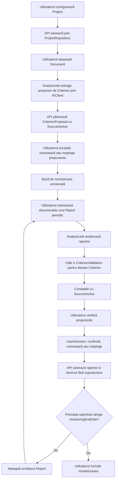

# Workflow de monitorizare

## 1. Principiu

Workflow-ul separă propunerea AI de decizia umană și păstrează rezultatele fiecărui raport. Singurul actor de business este utilizatorul; sistemul și Qwen sunt colaboratori tehnici fără autoritate finală.

## 2. Flux principal

## 3. Inițializarea proiectului

1. Utilizatorul creează un `Project` prin UI.
2. UI-ul trimite comanda către API; nu scrie direct în DB.
3. Utilizatorul atașează documentele proiectului.
4. API-ul pornește idempotent un `AnalysisJob` de tip `extract_criteria`,
   folosind numai `documentIds` selectate explicit.
5. AI-ul returnează date candidate; API-ul le păstrează ca
   `CriterionProposal`, fiecare cu cel puțin un `SourceAnchor` complet.
6. Utilizatorul alege `accept`, `correct` sau `reject` pentru fiecare
   propunere. `accept` și `correct` creează un `Criterion`; `reject` nu creează
   criteriu.
7. Propunerile și review-urile rămân auditabile după decizie.
8. Extracția adaugă propuneri și criterii aprobate fără să șteargă, să
   înlocuiască sau să dezactiveze criterii existente.
9. API-ul fixează o versiune a bazei de monitorizare.

## 4. Ciclul unui raport

1. Utilizatorul încarcă documentul principal și eventualele documente suport ale raportului periodic curent.
2. API-ul creează `Report`, asociază exact un document primar (`main_report` sau `final_document`) și zero sau mai multe documente suport (`attachment` sau `clarification`).
3. API-ul creează un `AnalysisJob` idempotent.
4. Jobul capturează snapshot-ul criteriilor active și selecțiile explicite de documente ale proiectului și rapoarte anterioare; Qwen este apelat numai prin `AIClient`.
5. Pentru fiecare criteriu din snapshot, AI-ul returnează o propunere separată.
6. API-ul validează structura fiecărei propuneri și prezența `SourceAnchor`.
7. API-ul creează câte o `CriterionValidation` pentru fiecare pereche raport-criteriu.
8. UI-ul afișează propunerile și poate ordona excepțiile primele.
9. Utilizatorul ia o `UserDecision` explicită asupra fiecărei validări necesare finalizării.
10. API-ul finalizează raportul și păstrează revizia, propunerile, sursele și deciziile. Nu actualizează statusul oficial și nu pornește clarificări în MyADR/MySMIS.

## 5. Continuitatea raportării

Un proiect primește rapoarte periodice până la `monitoringEndDate`, data contractuală explicită înregistrată pe proiect. Aplicația poate reprezenta cadențe diferite: de exemplu, rapoarte trimestriale în implementare și rapoarte anuale post-implementare. Cadența nu schimbă regula de izolare a validărilor.

La atingerea datei-limită, sistemul propune închiderea monitorizării, dar utilizatorul confirmă acțiunea. Orice abatere cerută de contract trebuie înregistrată explicit, nu ascunsă într-o valoare implicită.

## 6. Istoric și reanalizare

- Raportul 2 creează alte `CriterionValidation` decât Raportul 1.
- O reanalizare a Raportului 1 creează o revizie nouă legată de același raport.
- `UserDecision` indică revizia evaluată.
- Schimbarea ulterioară a unui `Criterion` nu rescrie snapshot-urile rapoartelor anterioare.
- Ștergerea fizică a istoricului nu face parte din fluxul normal.

## 7. Stări recomandate

`AnalysisJob`: `queued`, `running`, `succeeded`, `failed`, `cancelled`.

`AnalysisJob.kind`: `extract_criteria` sau `analyze_report`. Endpointul de
stare este comun, iar câmpurile specifice tipului sunt păstrate separat.

`CriterionProposalReview.action`: `accept`, `correct`, `reject`.

`Report.status`: `created`, `analysis_queued`, `analysis_in_progress`, `awaiting_user_decision`, `completed`, `analysis_failed`. Acesta este independent de `externalStatus`, care rămâne text opac.

`CriterionValidation`: `awaiting_user_decision`, `decided`, `insufficient_evidence`, `analysis_failed`.

`UserDecision.action`: `confirm`, `correct`, `reject`.

## 8. Reguli de eroare

- Lipsa documentului, paginii sau pasajului produce `insufficient_evidence`, nu o constatare fără suport.
- Eșecul unui criteriu nu anulează rezultatele valide ale celorlalte criterii; raportul rămâne incomplet până la rezolvare.
- Retry-ul unui `AnalysisJob` folosește aceeași cheie de idempotency și creează o revizie numai când există un rezultat nou complet.
- O propunere fără document, pagină sau pasaj invalidează rezultatul extracției; nu se creează automat un criteriu incomplet.
- Un batch de review-uri este atomic și idempotent; o revizie depășită sau o propunere deja revizuită produce conflict.
- Eșecul ori reluarea extracției nu șterge propunerile și criteriile existente.
- UI-ul nu ocolește API-ul pentru recuperare, editare sau finalizare.

## 9. Flux operațional implementat pentru verificarea unui raport

În MVP, ciclul unui raport este prezentat utilizatorului ca un task de verificare:

1. Utilizatorul selectează raportul din lista task-urilor proiectului.
2. Aplicația încarcă proiectul, raportul curent, documentele asociate și rapoartele anterioare.
3. AI-ul stabilește aplicabilitatea fiecărui criteriu la perioada raportată.
4. Pentru criteriile aplicabile, AI-ul compară raportul cu sursa criteriului, contractul/anexele și celelalte documente relevante, plus rapoartele periodice anterioare.
5. UI-ul ascunde rezultatele `ok` și `not_applicable` și afișează numai excepțiile: neconcordanțe, informații lipsă, valori/date diferite, dovezi insuficiente, contradicții între rapoarte și cazuri care necesită analiză umană.
6. Fiecare excepție este susținută prin `validation_sources`; modelul selectează ID-uri de evidence, iar textul/pagina sunt recuperate local din documente.
7. Utilizatorul confirmă, corectează, respinge sau solicită clarificări, printr-o `UserDecision` append-only.
8. Din constatările revizuite se generează o notă de verificare sau un draft de clarificare.
9. Draftul poate fi copiat sau exportat pentru transfer manual în sistemul oficial.
10. `AnalysisJob`, reviziile validărilor, deciziile și outputurile generate rămân în istoric.
