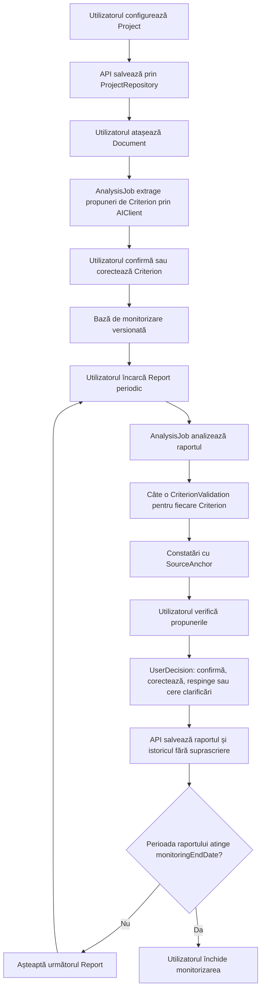

# Workflow de monitorizare

## 1. Principiu

Workflow-ul separă propunerea AI de decizia umană și păstrează rezultatele fiecărui raport. Singurul actor de business este utilizatorul; sistemul și Qwen sunt colaboratori tehnici fără autoritate finală.

## 2. Flux principal

## 3. Inițializarea proiectului

1. Utilizatorul creează un `Project` prin UI.
2. UI-ul trimite comanda către API; nu scrie direct în DB.
3. Utilizatorul atașează documentele proiectului.
4. API-ul pornește un `AnalysisJob` prin `AIClient` pentru propuneri de criterii.
5. Fiecare criteriu propus include sursa sa.
6. Utilizatorul confirmă sau corectează criteriile.
7. API-ul fixează o versiune a bazei de monitorizare.

## 4. Ciclul unui raport

1. Utilizatorul încarcă raportul periodic curent.
2. API-ul creează `Report`, asociază documentul încărcat și capturează snapshot-ul criteriilor active.
3. API-ul creează un `AnalysisJob` idempotent.
4. Qwen este apelat numai prin `AIClient`.
5. Pentru fiecare criteriu din snapshot, AI-ul returnează o propunere separată.
6. API-ul validează structura fiecărei propuneri și prezența `SourceAnchor`.
7. API-ul creează câte o `CriterionValidation` pentru fiecare pereche raport-criteriu.
8. UI-ul afișează propunerile și poate ordona excepțiile primele.
9. Utilizatorul ia o `UserDecision` explicită asupra fiecărei validări necesare finalizării.
10. API-ul finalizează raportul și păstrează revizia, propunerile, sursele și deciziile.

## 5. Continuitatea raportării

Un proiect primește rapoarte periodice până la:

`monitoringEndDate = completionDate + monitoringYears`

`monitoringYears` reprezintă `X` și este configurabil per proiect sau apel. Aplicația poate reprezenta cadențe diferite: de exemplu, rapoarte trimestriale în implementare și rapoarte anuale post-implementare. Cadența nu schimbă regula de izolare a validărilor.

La atingerea datei-limită, sistemul propune închiderea monitorizării, dar utilizatorul confirmă acțiunea. Orice abatere cerută de contract trebuie înregistrată explicit, nu ascunsă într-o valoare implicită.

## 6. Istoric și reanalizare

- Raportul 2 creează alte `CriterionValidation` decât Raportul 1.
- O reanalizare a Raportului 1 creează o revizie nouă legată de același raport.
- `UserDecision` indică revizia evaluată.
- Schimbarea ulterioară a unui `Criterion` nu rescrie snapshot-urile rapoartelor anterioare.
- Ștergerea fizică a istoricului nu face parte din fluxul normal.

## 7. Stări recomandate

`AnalysisJob`: `queued`, `running`, `succeeded`, `failed`, `cancelled`.

`CriterionValidation`: `proposed`, `awaiting_user`, `decided`, `insufficient_evidence`, `analysis_failed`.

`UserDecision`: `confirmed`, `corrected`, `rejected`, `clarification_requested`.

## 8. Reguli de eroare

- Lipsa documentului, paginii sau pasajului produce `insufficient_evidence`, nu o constatare fără suport.
- Eșecul unui criteriu nu anulează rezultatele valide ale celorlalte criterii; raportul rămâne incomplet până la rezolvare.
- Retry-ul unui `AnalysisJob` folosește aceeași cheie de idempotency și creează o revizie numai când există un rezultat nou complet.
- UI-ul nu ocolește API-ul pentru recuperare, editare sau finalizare.
